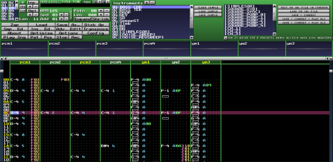

MilkyTracker - Cross-Platform XM Tracker
========================================

MilkyTracker is an multi-platform music application for creating .MOD
and .XM module files. It attempts to recreate the module replay and
user experience of the popular DOS program Fasttracker II, with
special playback modes available for improved Amiga ProTracker 2/3
compatibility.

Refer to http://milkytracker.titandemo.org/?about for further details.

Please read the file [INSTALL.md][] for installation instructions.

The [docs/readme_unix][] file contains notes specific to the SDL port
of MilkyTracker.

[INSTALL.md]:INSTALL.md
[docs/readme_unix]:docs/readme_unix

--------------------------
## BlitSTracker fork

***BlitSTracker*** version is a specific uggly hack fork that produces songs for Atari STe *BLITSnd* routine.

YM2149 emulation code integrated courtesy of *N.Pomarede*

--------------------------

## Changes

### 01.11.2022

Try to make YM bank .ini file management a bit more intuitive
* No default SYNTHYM.INI file loading
* First press on "(Re)Load YM bank" button will trigger a fileselector if no INI file defined
* When INI YM bank file selected (because you have loaded it specifically or in the same time you have opened a XM file), "(Re)Load YM bank" button will reload this file
* When saving a XM file, copy last selected .INI file as mymodule.ini file beside mymodule.xm file

Avoid errors when selecting a sound into ym sounds list : you now need to press "< Set YM sound" button to set name into regular instruments list from ym sounds list
